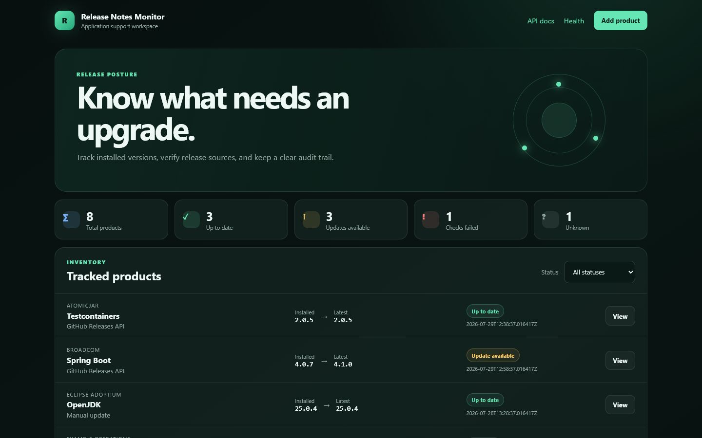
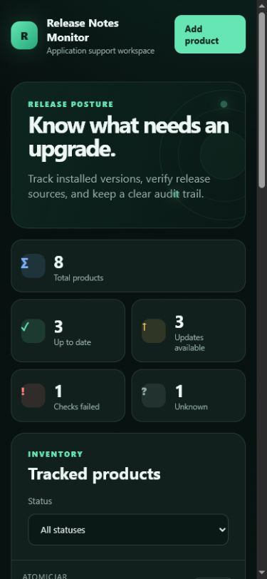
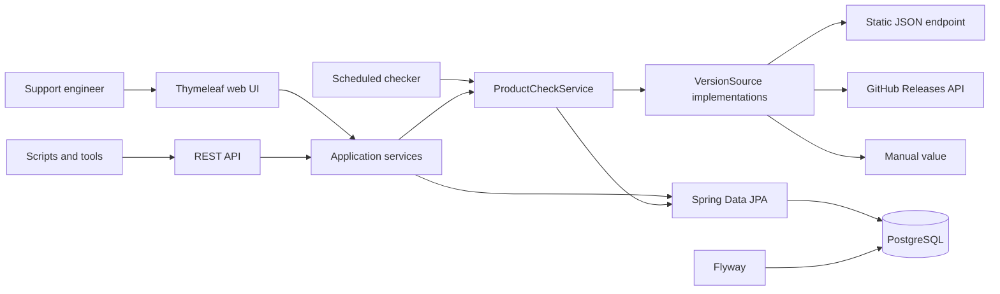
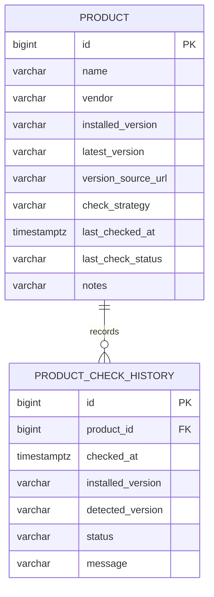

# Release Notes Monitor

[](https://github.com/German4341374/release-notes-monitor/actions/workflows/ci.yml)
[](https://openjdk.org/)
[](https://spring.io/projects/spring-boot)
[](LICENSE)

Release Notes Monitor is a compact application-support tool for tracking installed software versions,
discovering newer releases, and retaining an audit trail of every check. It combines a REST API,
scheduled jobs, PostgreSQL persistence, and a responsive operations dashboard.



<details>
<summary>Mobile dashboard</summary>



</details>

## Business problem

Support engineers often maintain a spreadsheet of installed products, manually visit vendor release
pages, and have no shared record of when a version was last checked. This project centralizes that
workflow and makes the result queryable through both a web interface and an API.

## Features

- Create, edit, view, filter, and delete tracked products.
- Compare installed and latest versions using semantic-version precedence.
- Fetch versions from static JSON endpoints and the GitHub Releases API.
- Record manual version values for products without a machine-readable source.
- Run checks on demand or on a configurable schedule.
- Record the latest 50 checks per product.
- Distinguish `Up to date`, `Update available`, `Check failed`, and `Unknown`.
- Display dashboard totals and a responsive Thymeleaf interface.
- Expose an OpenAPI-described REST API and `/health` endpoint.
- Apply Flyway migrations and seed a useful demonstration inventory.
- Run PostgreSQL integration tests through Testcontainers.

## Architecture



The version check performs network I/O before opening the short result-recording transaction. This
avoids holding a database transaction while waiting for an upstream service. See
[the architecture notes](docs/architecture.md) for the detailed decisions and trade-offs.

### Data model



## Supported version sources

| Strategy | Expected input | Behavior |
|---|---|---|
| Static JSON endpoint | An HTTP(S) URL returning `version`, `latestVersion`, or `tag_name` | Reads one semantic-version string from a bounded JSON response. |
| GitHub Releases API | A public `github.com/owner/repository` or GitHub API repository URL | Resolves the latest public release and reads `tag_name`. |
| Manual update | A value in `latestVersion` | Re-evaluates the manually maintained value without making a network request. |

Public GitHub repositories work without a token. `GITHUB_TOKEN` is optional and increases the
available API rate limit. The token is only added to the outbound authorization header and is never
written to application logs. Rate-limit responses are recorded as temporary check failures with the
reset time when GitHub provides it.

Automatic sources use configurable connect and request timeouts. Retries are limited to transport
failures and temporary HTTP responses (`429`, `500`, `502`, `503`, and `504`). Permanent client
errors are not retried.

## Technology stack

- Java 25 LTS
- Spring Boot 4.1
- Spring MVC, Validation, Data JPA, Actuator, and Thymeleaf
- PostgreSQL 18 and Flyway
- springdoc-openapi and Swagger UI
- JUnit, Mockito, AssertJ, JaCoCo, and Testcontainers
- Docker Compose and GitHub Actions

## Prerequisites

- Docker Engine with Docker Compose v2
- Git
- Optional for non-container development: JDK 25

The Maven Wrapper is pinned to Maven 3.9.16, so a global Maven installation is not required.
Windows users can run the commands from WSL2, Git Bash, or use `mvnw.cmd` in PowerShell.

## Docker startup

```bash
cp .env.example .env
docker compose up --build --detach
docker compose ps
```

Open:

- Dashboard: <http://localhost:8080/>
- Swagger UI: <http://localhost:8080/swagger-ui.html>
- Health: <http://localhost:8080/health>

Follow logs and stop the environment:

```bash
docker compose logs --follow app
docker compose down
```

Remove the local database volume only when its data is no longer needed:

```bash
docker compose down --volumes
```

## Local Java startup

Start PostgreSQL first, then provide the connection settings:

```bash
export DB_URL=jdbc:postgresql://localhost:5432/release_monitor
export DB_USERNAME=release_monitor
export DB_PASSWORD=local_development_only
./mvnw spring-boot:run
```

PowerShell:

```powershell
$env:DB_URL = "jdbc:postgresql://localhost:5432/release_monitor"
$env:DB_USERNAME = "release_monitor"
$env:DB_PASSWORD = "local_development_only"
.\mvnw.cmd spring-boot:run
```

Flyway applies the schema and seed migrations during startup.

## API examples

List products or filter by the persisted enum name:

```bash
curl http://localhost:8080/api/products
curl "http://localhost:8080/api/products?status=UPDATE_AVAILABLE"
```

Create a manually maintained product:

```bash
curl -X POST http://localhost:8080/api/products \
  -H "Content-Type: application/json" \
  -d '{
    "name": "Support Gateway",
    "vendor": "Example Platform",
    "installedVersion": "2.4.0",
    "latestVersion": "2.5.1",
    "versionSourceUrl": null,
    "checkStrategy": "Manual update",
    "notes": "Review the compatibility guide before upgrading."
  }'
```

Check a product and read its history:

```bash
curl -X POST http://localhost:8080/api/products/1/check
curl http://localhost:8080/api/products/1/history
curl http://localhost:8080/api/dashboard
```

Update and delete:

```bash
curl -X PUT http://localhost:8080/api/products/1 \
  -H "Content-Type: application/json" \
  -d '{
    "name": "Spring Boot",
    "vendor": "Broadcom",
    "installedVersion": "4.1.0",
    "latestVersion": "4.1.0",
    "versionSourceUrl": "https://github.com/spring-projects/spring-boot",
    "checkStrategy": "GitHub Releases API",
    "notes": "Framework baseline."
  }'

curl -X DELETE http://localhost:8080/api/products/1
```

Validation failures use RFC 9457 Problem Details with an `errors` object for field-level failures.

## Scheduling

Scheduled checks are enabled by Docker Compose and disabled by default for direct Java startup.
Configure them with:

```dotenv
SCHEDULE_ENABLED=true
SCHEDULE_CRON=0 0 */6 * * *
```

The cron expression uses UTC unless `SCHEDULE_ZONE` is set. Manual products are excluded from the
scheduled job.

## Test commands

```bash
./mvnw test
./mvnw verify
./mvnw -DskipTests package
```

`test` runs the unit and service tests. `verify` additionally runs `*IT` integration tests against a
real PostgreSQL Testcontainer and generates a JaCoCo report in `target/site/jacoco`.

Useful smoke checks:

```bash
curl --fail http://localhost:8080/health
curl --fail http://localhost:8080/api/dashboard
curl --fail http://localhost:8080/v3/api-docs
```

## Security considerations

- No credentials are committed; `.env` is ignored.
- The optional GitHub token is read from the environment and never logged.
- Only HTTP and HTTPS source URLs without embedded credentials are accepted.
- Response size, connect timeout, request timeout, and retry count are bounded.
- The application container runs as UID `10001`, drops Linux capabilities, and uses a read-only root
  filesystem in Compose.
- The database is reachable only on the internal Compose network.
- This project intentionally has no authentication. Do not expose it to an untrusted network without
  adding an authentication gateway.
- Static JSON sources may need private network access. Production deployments should enforce an
  outbound DNS/IP allow-list to reduce SSRF risk.

See [SECURITY.md](SECURITY.md) for reporting and deployment guidance.

## Troubleshooting

- `Connection refused` at startup: confirm the database is healthy with `docker compose ps`.
- Flyway checksum error: never edit an applied migration; add a new migration instead.
- GitHub checks fail with rate limiting: add an optional read-only token or wait until the recorded
  reset time.
- A product remains `Unknown`: provide a manual latest version or configure a reachable automatic
  source.
- Testcontainers tests are skipped: start Docker and run `./mvnw verify` again.

More operational guidance is available in [docs/operations.md](docs/operations.md).

## Limitations

- Semantic versions are supported; date-based and vendor-specific version schemes are out of scope.
- GitHub pre-releases are not returned by the `releases/latest` endpoint.
- Check history is intentionally limited to the latest 50 entries in the API and UI.
- There are no users, OAuth, email, or notification integrations.
- Scheduling is single-instance; a clustered deployment would require distributed job coordination.

## Possible next steps

- Add allow-listed vendor-specific source adapters.
- Support explicit pre-release tracking.
- Add optimistic locking for concurrent product edits.
- Add Prometheus metrics for check duration and failure categories.
- Add authentication through an external identity-aware proxy.
- Add a distributed scheduler lock for horizontally scaled deployments.

## License

Released under the [MIT License](LICENSE).
